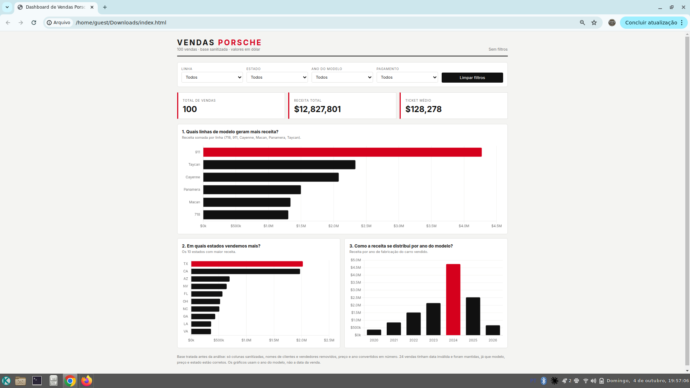
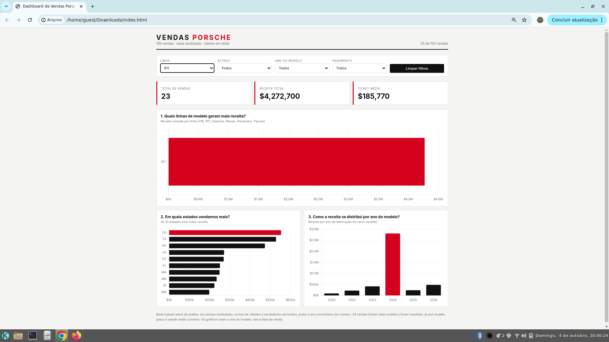

# Dashboard de Vendas Porsche

Dashboard interativa em HTML que transforma uma planilha de 100 vendas da Porsche em respostas para três perguntas de negócio.

**Dashboard publicada:** https://diebhumter7-pixel.github.io/dashboard-porsche/

## Perguntas de negócio

1. **Quais linhas de modelo geram mais receita?**
   Mostra onde está o dinheiro. Os modelos foram agrupados por linha (718, 911, Cayenne, Macan, Panamera, Taycan), porque a base tem mais de 40 versões e um gráfico com 40 barras não se lê.
   Resultado: a linha 911 lidera com US$ 4,27 milhões, mais que o dobro da segunda colocada (Taycan, US$ 2,33 milhões).

2. **Em quais estados vendemos mais?**
   Mostra onde concentrar esforço comercial. O gráfico exibe os 10 estados com maior receita.

3. **Como a receita se distribui por ano do modelo?**
   Mostra se a receita vem de carros novos ou de seminovos.

As três perguntas cobrem o tripé que toda gestão comercial acompanha: dinheiro (modelo), lugar (estado) e tempo (ano).

## Indicadores e filtros

- Indicadores de topo: total de vendas, receita total e ticket médio.
- Filtros: linha do modelo, estado, ano do modelo e método de pagamento, com botão para limpar.
- Todos os filtros recalculam indicadores e gráficos ao mesmo tempo.

Sem filtros: 100 vendas, US$ 12,8 milhões de receita e ticket médio de US$ 128 mil.

## Tratamento da base

A planilha original trazia cada campo em duas versões, a crua e a sanitizada. Antes de ir para a IA:

- Mantive só a coluna de id e as colunas sanitizadas.
- Removi os nomes de clientes e de vendedores, porque a base fica embutida no HTML e pública na internet.
- Converti preço, ano e quilometragem em número puro e colei tudo como valores, sem fórmulas.
- Renomeei os cabeçalhos para português: id, data, modelo, ano, preco, milhas, pagamento, cidade, estado.
- Renomeei a coluna de quilometragem para "milhas", que é a unidade real dos dados.
- Removi a coluna de status de entrega, que não respondia a nenhuma das perguntas.
- 24 vendas tinham data inválida (ex.: 30 de fevereiro). Mantive essas vendas, pois modelo, preço e estado estão corretos, e deixei a data vazia. Por isso os gráficos usam o ano do modelo, não a data da venda.

Pontos observados e mantidos como estavam: algumas datas de venda no futuro, quatro quilometragens muito baixas e vendas parecidas entre os ids 50–55 e 100–105. Nenhum deles afeta receita, modelo ou estado.

## Ferramenta usada

Não usei o ChatGPT com Canvas nem um agente do ChatGPT. Usei o **Claude** nos dois papéis:

- **Tratamento dos dados:** Claude integrado ao Excel, editando a planilha diretamente e criando a aba `base_limpa`.
- **Construção da dashboard:** Claude no chat, gerando o HTML a partir da base limpa.

Na prática, é o modelo de "agente com duas skills" sugerido no desafio: uma etapa trata o dado e outra desenha.

## Prompt e evolução

Prompt base:

> Você é especialista em visualização de dados. Crie uma dashboard em HTML, arquivo único, com os dados embutidos no código. A base tem 100 vendas da Porsche com as colunas: id, data, modelo, ano, preco, milhas, pagamento, cidade, estado.
>
> No topo, indicadores: total de vendas, receita total e ticket médio.
>
> Três gráficos, cada um respondendo uma pergunta de negócio, com a pergunta escrita como título:
> 1. Quais modelos geram mais receita? Barras horizontais, receita por modelo, do maior pro menor.
> 2. Em quais estados vendemos mais? Barras com receita por estado.
> 3. Como a receita se distribui por ano do modelo? Gráfico de colunas por ano.
>
> Filtros acima dos gráficos: modelo, estado, ano e pagamento. Todos recalculam indicadores e gráficos ao mudar, e tenha um botão de limpar filtros.
>
> Visual estilo Porsche: fundo claro, preto e vermelho nos destaques, tipografia moderna, valores em dólar formatados. Use Chart.js via CDN. Funcione bem no celular.

O que mudou até a versão final:

- O primeiro prompt previa cidade como filtro; troquei para **estado**, que agrupa melhor 100 vendas espalhadas por muitas cidades.
- "Receita por modelo" virou **receita por linha**, para o gráfico ficar legível.
- O gráfico de estados passou a mostrar só os **10 maiores**.
- Os métodos de pagamento foram traduzidos para português no filtro.
- A maior barra de cada gráfico fica em vermelho, para o destaque aparecer sem precisar ler os números.

## Visual

Paleta preto, branco e vermelho Porsche (#d5001c), fonte Inter, layout responsivo para celular.

## Arquivos

- `index.html` — a dashboard completa, com os dados embutidos.
- `README.md` — este documento.
- `print-dashboard.png` e `print-filtro.png` — evidências da dashboard rodando.
